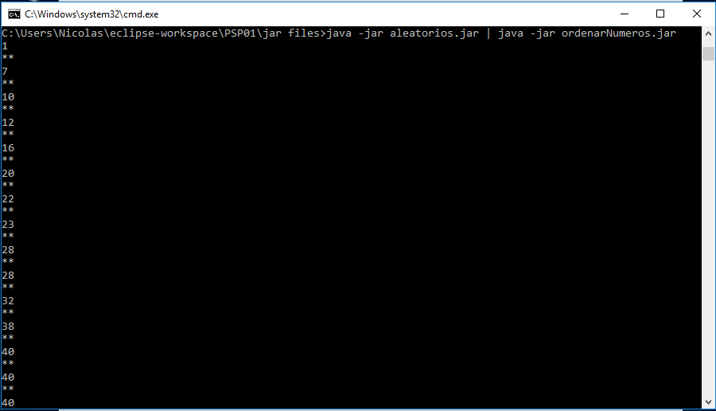

# Ejercicio 1

**Este es el ejercicio 1 de la unidad 1 de PSP:**

**Primera parte:**  implementa una aplicación que ordena un conjunto indeterminado de números que recibe a través de su entrada estándar; y muestra el resultado de la ordenación en su salida estándar. La aplicación se llamará 'ordenarNumeros'.

**Segunda parte:**  implementa una aplicación, llamada 'aleatorios', que genere al menos 40 números aleatorios (entre 0 y 100), y que los escriba en su salida estándar.

## Base de la tarea

Lo primero que debemos hacer es descarganos el ejemplo de la unidad PSP01_CONT_R041_ComunicacionProcesos.zip

## Uso

Para el uso de la aplicacion escribiremos los siguiente en la consola sirve tanto para Windows como Linux

`java -jar aleatorios.jar | java -jar ordenarNumeros.jar` 

`aleatorios.jar` genera 40 números aleatorios que son enviados a través de la tuberia al otro programa.  

`ordenarNumeros.jar` recibe por la tuberia los números los ordena y luego los muestra.

## Salida esperada

  

Veremos ordenados los 40 números
