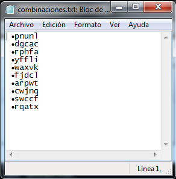
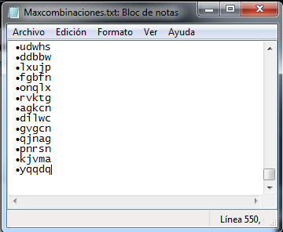
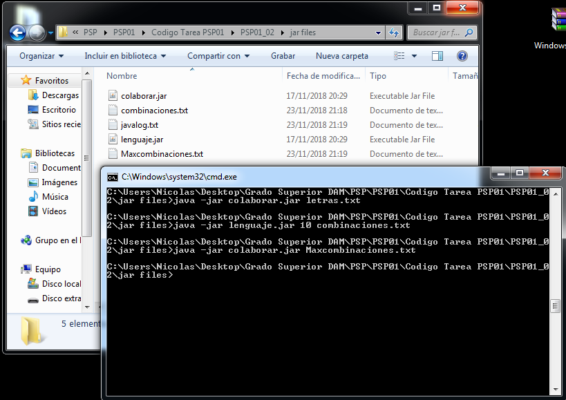

# Ejercicio 2

**Este es el ejercicio 2 de la unidad 1 de PSP:**

**Primera parte:** implementa una aplicación que escriba en un fichero indicado por el usuario conjuntos de letras generadas de forma aleatoria (sin sentido real). Escribiendo cada conjunto de letras en una línea distinta. El número de conjuntos de letras a generar por el proceso, también será dado por el usuario en el momento de su ejecución. Esta aplicación se llamará "lenguaje" y como ejemplo, podrá ser invocada así:
`java -jar lenguaje 40 miFicheroDeLenguaje.txt`
 implementa una aplicación que escriba en un fichero indicado por el usuario conjuntos de letras generadas de forma aleatoria (sin sentido real). Escribiendo cada conjunto de letras en una línea distinta. El número de conjuntos de letras a generar por el proceso, también será dado por el usuario en el momento de su ejecución. Esta aplicación se llamará "lenguaje" y como ejemplo, podrá ser invocada así:`java -jar lenguaje 40 miFicheroDeLenguaje.txt`

**Segunda parte:** implementa una aplicación, llamada 'colaborar', que lance al menos 10 instancias de la aplicación "lenguaje". Haciendo que todas ellas, colaboren en generar un gran fichero de palabras. Cada instancia generará un número creciente de palabras de 10, 20, 30, … Por supuesto, cada proceso seguirá escribiendo su palabra en una línea independiente de las otras. Es decir, si lanzamos 10 instancias de "lenguaje", al final, debemos tener en el fichero 10 + 20 + 30 + … + 100 = 550 líneas.

## Base de la tarea

Lo primero que debemos hacer es descarganos el ejemplo de la unidad PSP01_CONT_R049_AccesosRecursoCompartidoConSincro.zip

## Uso

### lenguaje.jar

`java -jar lenguaje.jar INT orden [STRING nombreFichero = "combinaciones.txt"]` 

#### Parámetros:

_orden_:  Indica el numero de palabras que se van a generar.

_nombreFichero_: Ruta del fichero que se va a generar y se deja en vacio el programa tiene una ruta por defecto.

La aplicacion genera combinaciones de letras en mi caso de 5 caracteres y las guarda en un fichero con una por linea por combinacion

### colaborar.jar

`java -jar colaborar.jar [STRING nombreFichero = "Maxcombinaciones.txt"]`

#### Parámetros:

_nombreFichero_: Ruta del fichero que se va a generar y se deja en vacio el programa tiene una ruta por defecto.

La aplicación crea 10 procesos de `lenguaje.jar` lo cual hace que todos los procesos escriban sobre el mismo archivo generando un gran fichero.
Los distintos procesos crean cada uno 10 palabras mas que el anterior con lo que el primer proceso crearia 10 palabras y el ultimo proceso 100.

## Salidas esperadas

### lenguaje.jar

`java -jar lenguaje.jar 10 combinaciones.txt`

  

Se nos generara el archivo combinaciones.txt con 10 palabras

### colaborar.jar

`java -jar colaborar.jar Maxcombinaciones.txt`

  

Se nos generara los archivos Maxcombinaciones.txt con las 550 palabras y otro archivo llamado javalog.txt en el que se guardan los pasos de insercion de palabras en el fichero anterior.

Captura de pantalla de la ejecucion de los 2 comandos 

